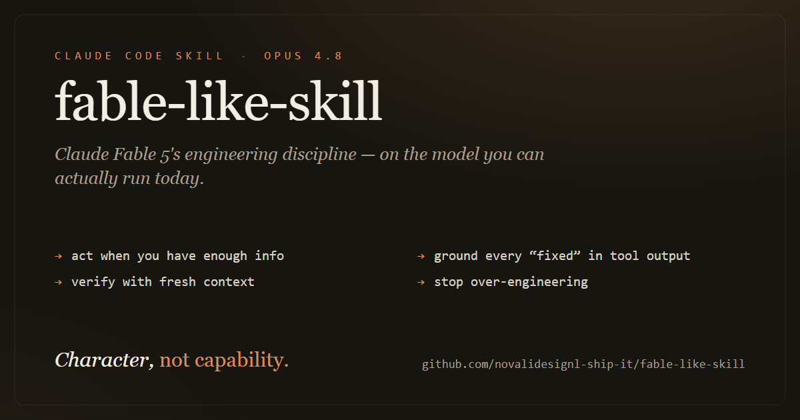

<p align="center">
  
</p>

# fable-like-skill — Claude Fable 5 engineering discipline for Claude Code

> A Claude Code skill that brings Claude Fable 5's engineering discipline to the model you run today (e.g. Claude Opus 4.8) — decisive action, progress claims grounded in tool output, fresh-context verification, and no over-engineering. Honest about the line between capability and character.

`fable-like-skill` is a **Claude Code skill** that ports a set of **prompt-tunable behavioral patterns** — the working "character" Anthropic published as migration guidance for its **Claude Fable 5** model — onto a **non-Fable** model such as **Claude Opus 4.8**. It's a single `SKILL.md` file: no runtime, no dependencies, no network calls.

## Capability vs. character — read this first

This is the one thing to be clear about, because it's the whole point:

- **It does not raise capability.** No new weights, no extra intelligence, no higher ceiling on what the model can solve.
- **It changes how capability is spent.** Same model, different working character — more discipline, persistence, grounding, and restraint in how the model uses what it already has.

The honest framing: you get **"Opus 4.8 acting Fable-ish," not Fable.** If a task is genuinely beyond your base model's ability, this skill will not close that gap. What it changes is the *quality of the work* on tasks the model can already do — fewer false "it's fixed" claims, less gold-plating, less wandering, clearer reporting.

One-liner: *it tunes the character, not the capability.*

## Install (30 seconds)

```bash
mkdir -p ~/.claude/skills/fable-like-skill
cp SKILL.md ~/.claude/skills/fable-like-skill/SKILL.md
```

That's it. Claude Code is **description-driven**: it reads the skill's description and activates it automatically when your task matches — writing, fixing, reviewing, debugging, testing, or any long-horizon agentic work. No config, no flag.

Want to force it on for a turn:

```
/fable-like-skill
```

Useful when you want the discipline on a task that doesn't obviously look like coding — a research sweep, a large refactor, a multi-step migration — or when you just want to be sure it's active.

## Why (inspired by Fable 5)

Claude Fable 5 was Anthropic's most capable **widely-released** model, launched around **June 9, 2026**. It was disabled globally a few days later (around **June 12, 2026**) under a US government export-control directive issued after a public jailbreak — a decision Anthropic is **complying with while publicly disputing**, calling it a likely misunderstanding.

You probably can't run Fable today. But alongside the model, Anthropic published migration guidance describing the *behavioral shifts* that made Fable feel disciplined and reliable in agentic work — and those shifts are prompt-tunable. The model is gone; the playbook isn't. This skill distills that guidance into a reusable behavioral layer so you get Fable's working manner on the model in front of you, sourced entirely from Anthropic's own public documentation.

## The 10 principles

The behavioral patterns the skill installs. Read them once and you'll recognize the Fable working style.

1. **Act when you have enough information** — don't re-litigate settled decisions or survey options you won't take.
2. **Don't over-engineer; don't tidy uninvited** — no cleanup around a bug fix; validate only at system boundaries.
3. **Ground every progress claim in tool output** — never declare "fixed" off reasoning or a single clean run.
4. **Respect the assessment/action boundary** — if the user is asking, the deliverable is your assessment; report and stop.
5. **Lead with the outcome** — first sentence is the TLDR; readable beats terse.
6. **Verify with fresh context** — a separate verifier or sub-agent catches more than same-context self-critique; run the tests, read the result.
7. **Cover first, filter later** — when hunting bugs, report all findings with confidence + severity, then rank in a separate step.
8. **Delegate when the work fans out** — parallel sub-agents for independent items; don't spawn for what you can do in one pass.
9. **Memory discipline** — check notes before long tasks; one lesson per note; don't duplicate.
10. **Persist to done or to a real blocker** — don't end on a plan, a promise, or an unneeded question.

These are model-agnostic prompting patterns, packaged for Claude Code and exercised against Claude models (Opus 4.8 and the like).

## Plus — general agent hygiene

Four reliability habits bundled in alongside the ten. They are **not** from the Fable guidance — they're ordinary engineering and agent practice — but they reinforce the same goal:

11. **Know your tools before acting** — read the relevant skill/docs and check existing helpers instead of guessing or reinventing.
12. **Gather context before acting or answering** — read the files, fetch the data, reproduce the state *before* you respond or edit.
13. **Handle failure at real boundaries** — guard I/O, storage, network, and external APIs explicitly (missing keys/paths often throw, not return null); the flip side of principle 2.
14. **Separate scratch from deliverables** — keep working/temp/build artifacts out of the paths that represent the final output.

## How it fits your workflow

The skill rides alongside the slash commands you already have. A typical disciplined loop:

```
/code-review     →   surface findings (cover first, filter later)
   ↓
apply fixes      →   grounded in the review, no uninvited tidying
   ↓
/verify          →   fresh-context check; run it, read the output
```

And when a change has drifted toward over-engineering:

```
/simplify        →   strip it back to what the task actually needed
```

The skill's job is to make each step happen the right way: review that covers broadly, fixes that stay in scope, verification grounded in real output instead of optimism. The skill sets the working character; the commands give it concrete checkpoints.

## When it kicks in

You don't invoke it for most things — it activates itself when the task looks like:

- Writing, fixing, reviewing, debugging, or testing code
- Any multi-step agentic task with a real finish line
- Work that fans out into independent pieces (where delegation earns its keep)

For a quick factual question or a one-line lookup, it stays out of your way.

## FAQ

**Is this Fable 5?**
No. It's your current model wearing Fable's working habits. The intelligence is whatever model you're running; only the manner is ported.

**Will it make my model better at hard problems?**
Not in the raw-capability sense. It makes your model *spend* its capability better — less thrashing, fewer false "done"s, less unrequested churn. On long agentic tasks that often shows up as noticeably better outcomes, but it's discipline doing the work, not a higher ceiling.

**Did this come from a leak?**
No. A large (~120K-character) Fable 5 system prompt *did* leak via jailbreak within days of launch — but this skill deliberately does **not** use it. That prompt is operational scaffolding for Fable's own harness (tool, file, memory, citation, and formatting rules); sourcing behavior from a jailbroken leak would be both unethical and unreliable. This skill is distilled instead from Anthropic's own [public migration guidance](#provenance) on prompt-tunable behavior.

**Does it work on non-Anthropic models?**
The principles are model-agnostic prompting patterns, but the skill is packaged for Claude Code and tuned against Claude models. That's where it's been exercised.

## Provenance

The **ten core principles** are distilled — not quoted verbatim — from Anthropic's official, public Claude Fable 5 migration guidance (the prompt-tunable "behavioral shifts" section). The **general agent hygiene** items (11–14) are universal engineering practice, not Fable-specific and not lifted from any system prompt.

Public sources:

- Anthropic — [Introducing Claude Fable 5 and Claude Mythos 5](https://www.anthropic.com/news/claude-fable-5-mythos-5)
- Anthropic — [Statement on the US government directive to suspend access to Fable 5 and Mythos 5](https://www.anthropic.com/news/fable-mythos-access)
- Anthropic docs — [Introducing / Prompting Claude Fable 5](https://platform.claude.com/docs/en/about-claude/models/introducing-claude-fable-5-and-mythos-5)

Sourcing from public guidance keeps the skill on the right side of the line ethically, and means every core principle traces back to behavior Anthropic itself documented and recommended. You're getting a published working manner, reapplied — not a copy of a model.

---

*`fable-like-skill` is an independent skill inspired by Anthropic's public migration guidance. It is not affiliated with or endorsed by Anthropic, ships no Anthropic weights or proprietary prompt, and does not reproduce or substitute for the Claude Fable 5 model.*
